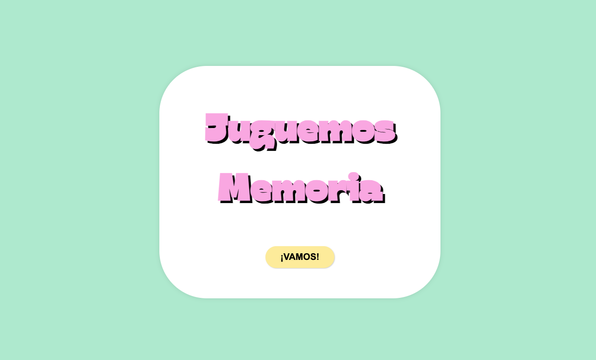
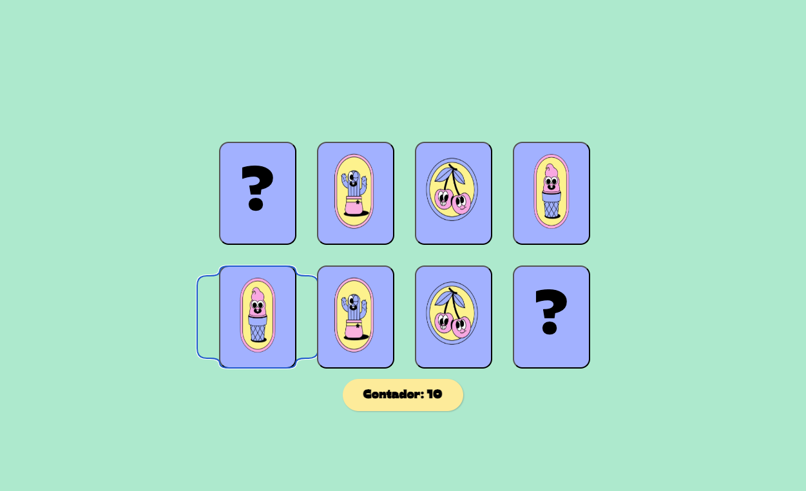
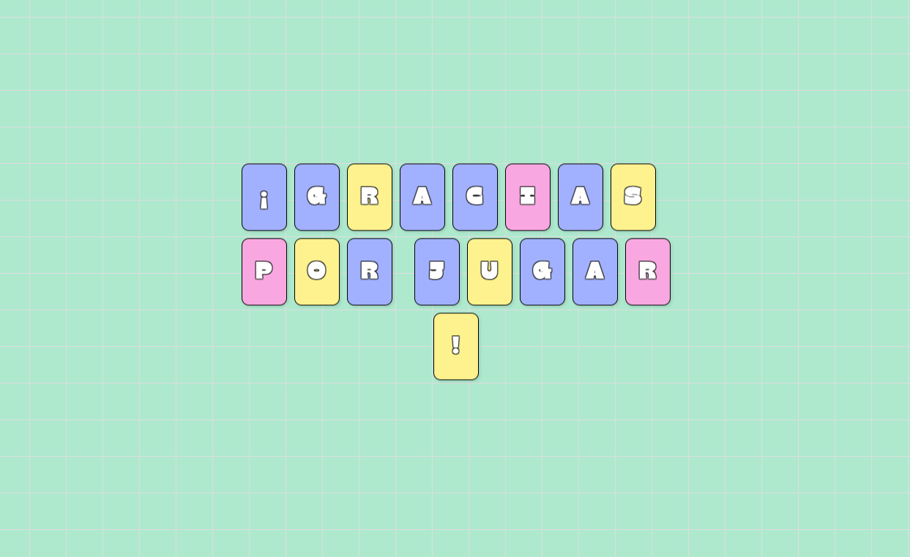

# Memoria en React - Lab #6 🃏⚛️

Este proyecto es una pequeña aplicación de React creada como parte del **Laboratorio #6**. El objetivo es implementar un juego interactivo con componentes de React, uso de estado, eventos, y cambios de pantalla.

## 🎮 Descripción del juego

El juego consiste en una interfaz simple con cinco cartas. Cada vez que el jugador hace clic en una carta, se incrementa un contador global. Al llegar a 5 clics, se muestra una pantalla de finalización con un mensaje de agradecimiento.

## 🧠 Tecnologías utilizadas

- React.js (con JSX)
- HTML y CSS (para el diseño básico)
- JavaScript (para la lógica)
- ReactDOM para renderizar en el navegador

## 📁 Estructura del código

- `Card`: Componente de carta individual que muestra una imagen. Al hacer clic, incrementa el contador global.
- `PantallaInicial`: Pantalla de bienvenida con un botón "Iniciar".
- `PantallaJuego`: Pantalla principal del juego con las cartas y el contador de clics.
- `PantallaFinal`: Pantalla final que se muestra al alcanzar 5 clics.
- `App`: Componente principal que gestiona la navegación entre pantallas (`inicial`, `juego`, `final`).

## 🔄 Lógica de juego

1. Se inicia en la **PantallaInicial**.
2. Al hacer clic en "Iniciar", se cambia a la **PantallaJuego**.
3. Cada clic en una carta incrementa el contador.
4. Cuando todas las cartas son volteadas, se cambia automáticamente a la **PantallaFinal**.
5. La aplicación se puede reiniciar recargando la página.

## 🖼️ Vista previa





## 🚀 Cómo ejecutar el proyecto

1. Clona este repositorio:
   ```bash
   git clone https://github.com/NESHGP04/Lab6-React.git


